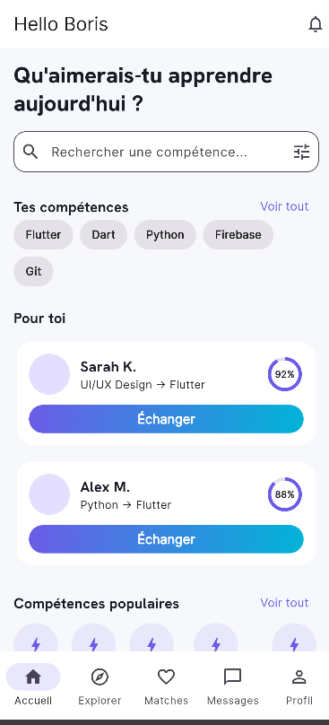
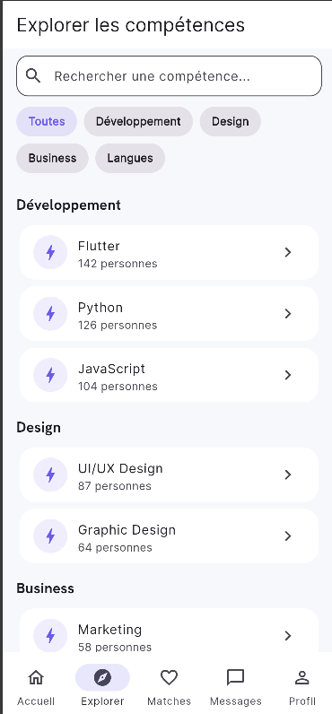
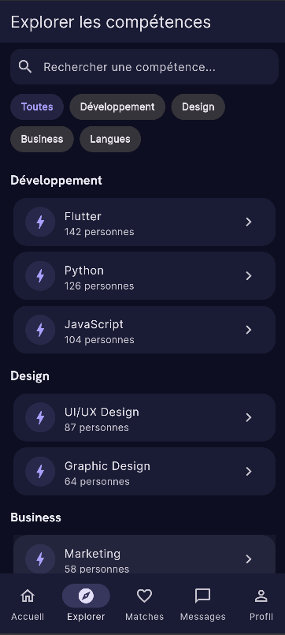
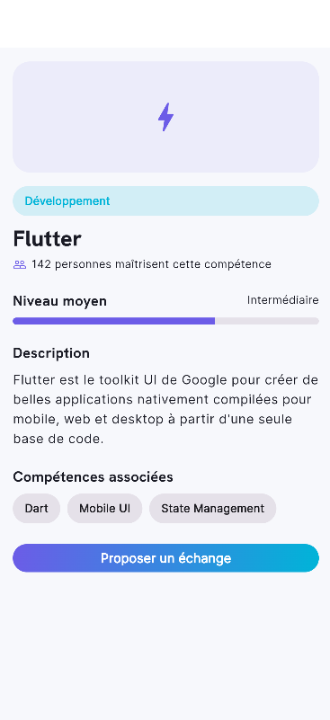
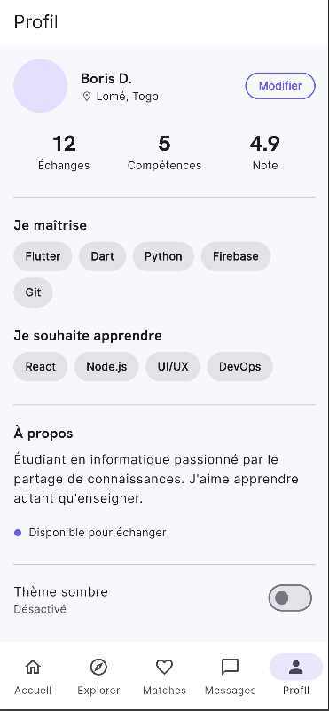
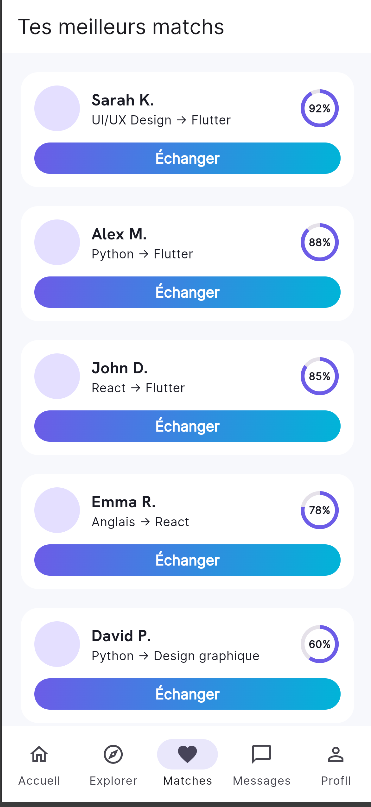
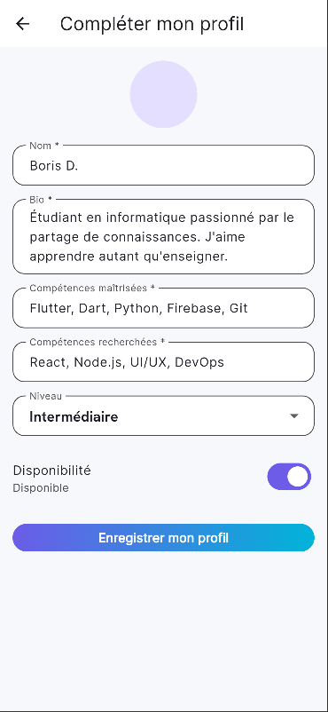

# Swapfy — Plateforme d'échange de compétences

Application mobile multi-écrans développée avec Flutter, permettant à des étudiants et jeunes apprenants d'échanger leurs compétences entre eux : "Apprends autrement, partage ce que tu sais."

[](https://github.com/BorisDANSOU/swapfy/actions/workflows/ci.yml)

## Architecture

Swapfy sépare l'interface des sources de données avec des repositories injectables. Firebase Auth gère la session; Firestore fournit les profils, compétences et conversations. Les fake repositories permettent des tests déterministes sans réseau. Les traductions FR/EN sont générées depuis `l10n/`.

## Aperçu

Swapfy connecte des personnes qui souhaitent enseigner une compétence (ex: Flutter) avec d'autres qui la recherchent, en échange d'une compétence différente (ex: UI/UX Design). L'application propose un système de matching par compatibilité, une messagerie intégrée, et un profil complet.

## Captures d'écran

### Accueil


### Explorer


### Explorer (mode sombre)


### Détail d'une compétence


### Profil


### Matches


### Messages


### Modifier le profil



## Fonctionnalités

- **Accueil** : compétences de l'utilisateur, suggestions de matchs, compétences populaires
- **Explorer** : recherche en temps réel et filtrage par catégorie des compétences disponibles
- **Détail d'une compétence** : description complète, niveau, compétences associées, personnes qui la maîtrisent (reçoit l'id de la compétence via les paramètres de navigation)
- **Matches** : liste des profils compatibles, triés par pourcentage de compatibilité
- **Messages & Conversation** : conversations et messages persistés dans Firestore
- **Profil** : statistiques (échanges, compétences, note), compétences maîtrisées/recherchées, bascules thème clair/sombre et langue FR/EN
- **Modifier le profil** : formulaire validé et profil enregistré dans Firestore

## Navigation

Navigation gérée avec **GoRouter**, routes nommées avec passage de paramètres dynamiques :

/ → Accueil
/explore → Explorer
/skill/:id → Détail d'une compétence (paramètre : id)
/matches → Matches
/messages → Messages
/messages/:userId → Conversation (paramètre : userId)
/profile → Profil
/profile/edit → Modifier le profil


## Installation

1. Clone le repo :
```bash
   git clone https://github.com/BorisDANSOU/swapfy.git
   cd swapfy
```

2. Installe les dépendances :
```bash
   flutter pub get
```

3. Pour activer Firebase :
```bash
   dart pub global activate flutterfire_cli
   flutterfire configure
```

## Lancer l'application

```bash
flutter run -d chrome
```

*(fonctionne aussi sur émulateur Android/iOS ou appareil physique avec `flutter run`)*

### Données de test

Les fake repositories sont injectés dans les tests unitaires, widget et d'intégration. Le lancement normal utilise Firebase; sans configuration valide, l'application ne bascule pas silencieusement sur les fixtures.

## Vérification qualité

```bash
dart format --output=none --set-exit-if-changed .
flutter analyze
flutter test
npm ci --prefix firestore-rules-tests
npm test --prefix firestore-rules-tests
```

Pour les tests d'intégration sur un émulateur Android démarré :

```bash
flutter test integration_test -d emulator-5554
```

La génération i18n s'effectue avec `flutter gen-l10n`. Les règles Firebase, la configuration locale et les secrets GitHub requis par les workflows sont détaillés dans [docs/firebase-setup.md](docs/firebase-setup.md). La procédure de mesure en mode profile est dans [docs/performance.md](docs/performance.md).

Un APK debug peut être téléchargé depuis l'artifact `swapfy-debug-apk` du workflow Android après lancement manuel ou publication d'un tag `v*.*.*`.

## Structure du projet

lib/
├── main.dart # Point d'entrée, assemble thème + router
├── app/
│ ├── theme.dart # Thème clair/sombre, couleurs, polices
│ ├── router.dart # Configuration GoRouter (routes nommées)
│ └── theme_controller.dart # Gestion globale du thème clair/sombre
├── models/
│ ├── user.dart # Modèle utilisateur/profil
│ ├── skill.dart # Modèle compétence
│ ├── message.dart # Message Firestore
│ └── conversation.dart # Conversation Firestore
├── repositories/
│ ├── firebase/ # Auth, profils, compétences et messagerie Firestore
│ └── fake/ # Implémentations déterministes pour les tests
├── data/
│ ├── users.dart # Données de démonstration (utilisateurs)
│ └── skills.dart # Données de démonstration (compétences)
├── screens/
│ ├── home_screen.dart
│ ├── explore_screen.dart
│ ├── skill_detail_screen.dart
│ ├── matches_screen.dart
│ ├── messages_screen.dart
│ ├── conversation_screen.dart
│ ├── profile_screen.dart
│ └── edit_profile_screen.dart
└── widgets/
├── custom_button.dart # Bouton avec variantes dégradé/contour
├── skill_chip.dart # Badge compétence/catégorie/niveau
├── user_card.dart # Carte utilisateur réutilisable
├── match_card.dart # Carte match avec cercle de compatibilité
└── search_bar.dart # Barre de recherche réutilisable


## Choix techniques

- **Navigation** : GoRouter avec routes nommées et paramètres dynamiques (`/skill/:id`, `/messages/:userId`)
- **Séparation UI/données** : les écrans de production reçoivent les repositories depuis `AppRouter`; les fixtures `data/` sont réservées au fallback des tests/widgets isolés
- **Widgets réutilisables** : 5 widgets partagés entre plusieurs écrans (`CustomButton`, `SkillChip`, `UserCard`, `MatchCard`, `CustomSearchBar`)
- **Thème clair/sombre** : géré via `ThemeController` (`ChangeNotifier`), écouté globalement par `main.dart` et localement par `ProfileScreen` via `ListenableBuilder`
- **Formulaire** : `Form` + `TextFormField` avec validation sur 4 champs (nom, bio, compétences maîtrisées, compétences recherchées)
- **Responsive** : `MediaQuery` utilisé pour contraindre la largeur des bulles de conversation ; mise en page basée sur `Expanded`/`Wrap` pour s'adapter à différentes tailles d'écran
- **Widgets Flutter utilisés** (8+) : `ListView`, `GridView`-like (`Wrap`), `Stack`, `Card`, `Form`, `TextField`, `CircularProgressIndicator`, `NavigationBar`, `Chip`, `Dialog`/`SnackBar`

## Auteur

DANSOU Vénunyé Boris
Étudiant en Génie Logiciel — Institut Polytechnique DEFITECH, Lomé, Togo